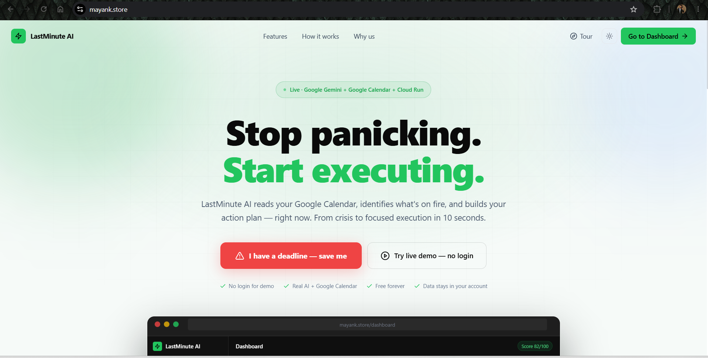
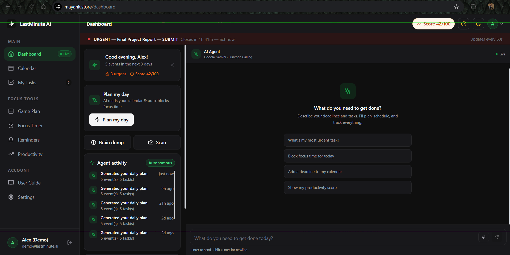
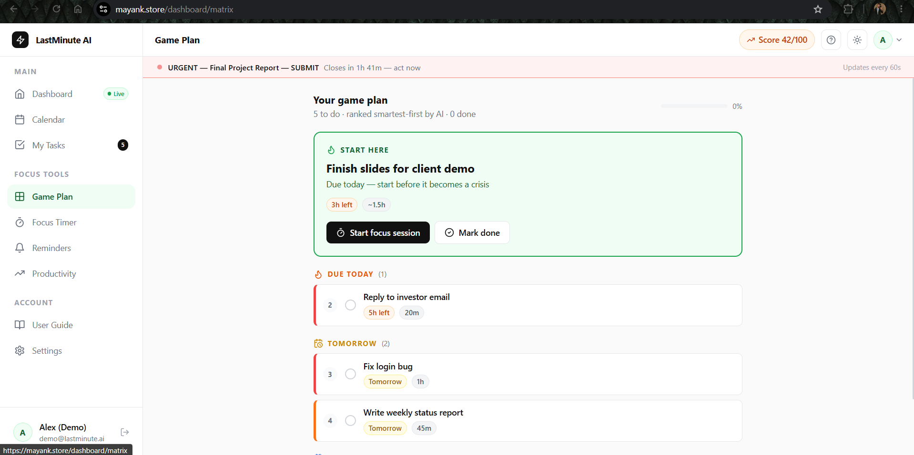
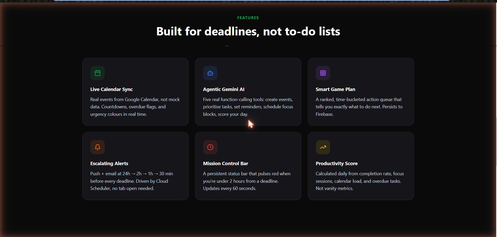

# LastMinute AI — Your Deadline Co-Pilot

[](https://github.com/mayank2295/LastMinute-AI/actions/workflows/ci.yml)
[](LICENSE)
[](https://mayank.store)
[](https://ai.google.dev)

> An autonomous, AI-powered productivity agent that connects to your Google
> Calendar, finds what's on fire, and proactively builds and executes your plan
> — before it's too late.

Built for the **BlockseBlock National Hackathon 2026** — PS1: The Last-Minute Life Saver

- 🌐 **Live app:** **https://mayank.store** (also always available at https://lastminute-ai-ummt2blwla-el.a.run.app)
- ▶️ **Try instantly:** click **"Try live demo — no login"** on the landing page (full product, sample data, zero setup).
- 📄 **Project description (Google Doc):** https://docs.google.com/document/d/1z5qL-mFQ1diOUQeXJiTSeqDYk5I7xBLT/edit?usp=sharing

---

## Screenshots

| Landing | Dashboard — agentic Gemini chat |
|:---:|:---:|
|  |  |
| **Smart Game Plan — ranked action queue** | **Features** |
|  |  |

---

## Features

- **Plan My Day** — Google Gemini reads your calendar and auto-blocks focus time on your real Google Calendar (runs proactively, once per day, no click needed)
- **Agentic AI chat** — Google Gemini with function calling (5 real tools: create events, prioritise tasks, find free slots, set reminders, fetch deadlines)
- **Brain Dump** — paste a chaotic paragraph; Gemini extracts, dates, estimates, and prioritises every task
- **Gemini Vision (Scan)** — upload a photo of a syllabus/timetable; deadlines become tasks
- **Smart Game Plan** — a ranked, time-bucketed action queue that tells you exactly what to do next
- **Goals & Habits** — set a goal and Gemini breaks it into milestones; build daily habits with streak tracking
- **Live Google Calendar sync** with countdowns and urgency colours
- **Escalating push reminders** at 24h / 2h / 1h / 30 min before each deadline (Cloud Scheduler-driven)
- **Mission Control status bar** that pulses red within 2 hours of a deadline
- **Focus Timer** (Pomodoro / Deep Work / Sprint) with sessions saved to Firestore
- **Productivity score** from completion rate, focus sessions, and calendar load
- **Settings & User Guide** pages, guided tour, **dark / light mode**, and **Demo Mode** (no login)

---

## Architecture


Your browser runs a React SPA served by a single FastAPI container on **Google Cloud
Run**. That backend uses **Gemini** to think, the **Calendar API** to read/write your
schedule, **Firestore** to remember everything, and **Web Push** for alerts. **Google
OAuth** signs you in, **Secret Manager** guards keys, and **Cloud Scheduler** triggers
autonomous actions. Full walkthrough in **[docs/TECH_GUIDE.md](docs/TECH_GUIDE.md)**.

---

## Tech Stack

| Layer | Technology |
|-------|-----------|
| AI Engine | **Google Gemini 2.0 Flash** (function calling + vision) |
| Calendar | Google Calendar API v3 (`calendar.events` scope) |
| Auth | Google OAuth 2.0 |
| Database | Google Firebase Firestore |
| Scheduling | Google Cloud Scheduler |
| Secrets | Google Secret Manager |
| Backend | Python 3.11 · FastAPI · Uvicorn |
| Frontend | React 18 · Vite · Tailwind CSS · Framer Motion |
| Deployment | Google Cloud Run (containerised) · Cloudflare (custom domain) |
| Notifications | Web Push API + VAPID |

---

## Google Technologies Used

- **Google Gemini 2.0 Flash** — the core AI engine: agentic chat (function calling), the autonomous daily planner, the brain-dump extractor, and the Vision document scanner.
- **Google Calendar API** — two-way integration: reads events and creates events/focus blocks. Uses the **least-privilege `calendar.events` scope** (no access to other calendars, settings, or sharing).
- **Google Cloud Run** — serverless container hosting the live production app.
- **Google Cloud Scheduler** — drives autonomous behaviour (reminder checks and planning).
- **Firebase Firestore** — persistent store for sessions, tasks, conversations, reminders, focus sessions.
- **Google Secret Manager** — secure storage of the Firebase service-account key.
- **Google OAuth 2.0** — secure sign-in and scoped Calendar access; no passwords stored.

---

## Local Setup

### Prerequisites
- Python 3.11+, Node.js 18+
- Google Cloud project with Calendar API enabled
- Firebase project with Firestore enabled
- **Gemini API key** from Google AI Studio (https://aistudio.google.com/apikey)

### Backend
```bash
cd backend
python -m venv venv
venv\Scripts\activate
pip install -r requirements.txt
cp .env.example .env   # add GEMINI_API_KEY, GOOGLE_CLIENT_ID/SECRET, Firebase + VAPID keys
uvicorn main:app --reload --port 8000
```

### Frontend
```bash
cd frontend
npm install
npm run dev   # http://localhost:5173
```

### Tests
```bash
cd backend && python -m pytest tests/ -q
```

### OAuth Setup
1. Google Cloud Console → APIs & Services → Credentials → OAuth 2.0 Client ID (Web)
2. Authorized origin: `http://localhost:5173`
3. Redirect URI: `http://localhost:8000/api/auth/callback/google`

---

## Deployment

One command: `.\deploy.ps1` (builds the frontend, bundles it into the backend, and
deploys via Cloud Build — reads `backend/.env`, no secrets hardcoded). The custom
domain (`mayank.store`) is served through a free **Cloudflare Worker** reverse proxy
(`infra/cloudflare-worker.js`). Full architecture and deployment walkthrough in
**[docs/TECH_GUIDE.md](docs/TECH_GUIDE.md)**.

---

## Documentation

- **[docs/TECH_GUIDE.md](docs/TECH_GUIDE.md)** — architecture & deployment reference
- **[docs/LEARNING_GUIDE.md](docs/LEARNING_GUIDE.md)** — how everything works, explained
- **[docs/SUBMISSION.md](docs/SUBMISSION.md)** — project description with UML diagrams

---

## License
[MIT](LICENSE) © 2026 Mayank Gupta
