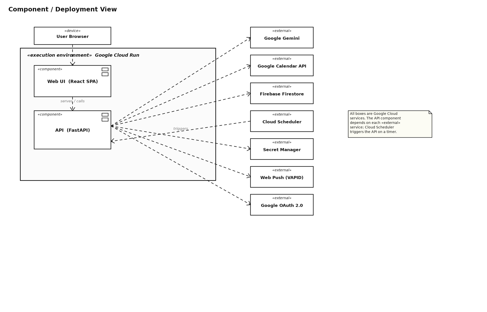
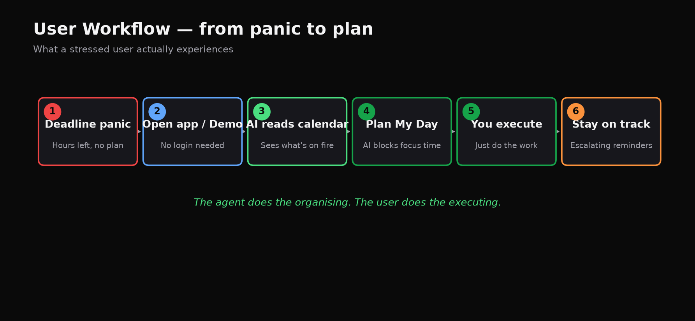
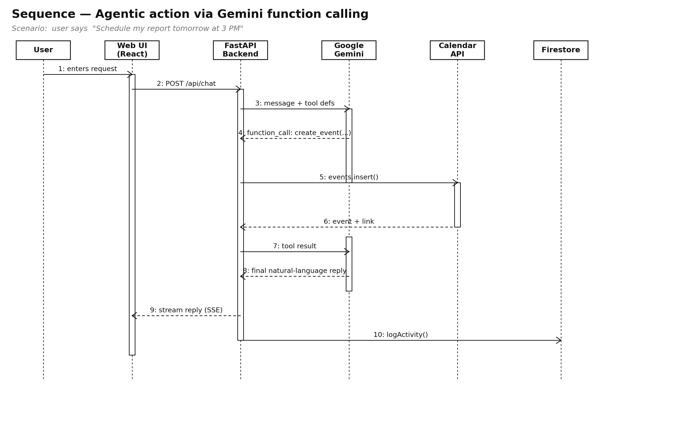
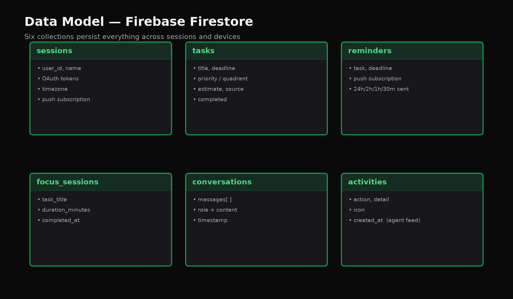
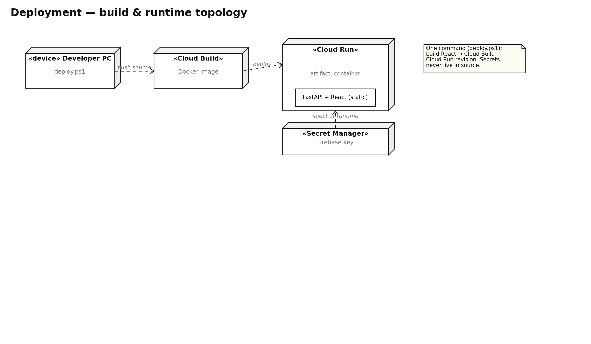

# LastMinute AI — Project Description

### BlockseBlock National Hackathon 2026 · Problem Statement: *The Last-Minute Life Saver*

| | |
|---|---|
| 🌐 **Live App** | https://lastminute-ai-ummt2blwla-el.a.run.app |
| 💻 **GitHub** | https://github.com/mayank2295/LastMinute-AI |
| 📄 **Project Description (Google Doc)** | https://docs.google.com/document/d/1z5qL-mFQ1diOUQeXJiTSeqDYk5I7xBLT/edit?usp=sharing |
| ▶️ **Fastest way to evaluate** | Click **“Try live demo — no login”** on the landing page — full product, sample data, zero setup. |

---

## 🎯 In one line

**LastMinute AI is an autonomous AI agent that reads your Google Calendar and takes
real action to beat your deadlines — it plans your day, blocks your focus time, and
escalates reminders, all by itself — powered by Google Gemini on Google Cloud.**

The magic moment: *you open the app and it has already planned your day and created
focus-time blocks on your real calendar — before you typed a single word.*

---

## 1. Problem Statement Selected — *The Last-Minute Life Saver*

Picture the moment everyone dreads: a deadline is **two hours away**, your calendar is
chaos, and you freeze — not because you can't do the work, but because you don't know
*where to start*.

This is a universal pain for students, professionals, and founders. And today's tools
make it worse, not better:

- **To-do apps are passive.** They hold a list and buzz a reminder — then do nothing to
  help you actually finish.
- **AI chatbots only talk.** ChatGPT can *advise* ("break it into smaller tasks") but it
  can't *touch* your calendar or take any action.

The result is **decision paralysis at the worst possible time.** The problem isn't a
lack of reminders — it's the lack of an assistant that will *act*.

---

## 2. Solution Overview

LastMinute AI is a **proactive, agentic productivity co-pilot.** Instead of waiting for
instructions, it connects to your Google Calendar, figures out what's most urgent, and
**takes action on your behalf** — using **Google Gemini** as its brain and the **Google
Calendar API** as its hands.

It doesn't just answer questions; it **does things**: creates calendar events, blocks
focus time in your free gaps, prioritises your tasks, and fires escalating reminders —
autonomously, even when the app is closed. The entire product is **live and deployed on
Google Cloud Run**, and anyone can try it instantly through a no-login **Demo Mode**.

*Figure 1 — UML component & deployment view: the Google Cloud Run execution environment and its «external» Google services.*

*Plain-English version of the diagram:* Your browser runs a fast web app. That talks to
one program on Google Cloud Run. That program uses **Gemini** to think, the **Calendar
API** to read and write your schedule, **Firestore** to remember everything, and **Web
Push** to send alerts. **Google OAuth** logs you in safely, **Secret Manager** guards
the keys, and **Cloud Scheduler** wakes the app every few minutes so it can act on its
own. Every single piece is Google technology.

---

## 3. How It Works

### For anyone — the user's journey

*Figure 2 — UML activity diagram: the flow from deadline panic to completion.*

1. You're in a **deadline panic**.
2. You **open the app** (or click Try Demo — no login).
3. The AI **reads your calendar** and sees what's on fire.
4. **Plan My Day** writes your plan and **blocks focus time** on your real calendar.
5. You just **execute** — the organising is done for you.
6. **Escalating reminders** keep you on track to the finish line.

### For the technical reviewer — how the agent *acts*

The core of the product is **function calling**. Gemini isn't just generating text — it
decides which real action to take, and our backend executes it. Here is exactly what
happens when you say *"schedule my report tomorrow at 3 PM":*

*Figure 3 — UML sequence diagram: an agentic action via Gemini function calling.*

The message hits the API → the backend gives Gemini the user's context and a set of
tools → Gemini **chooses** `create_calendar_event(...)` → the backend calls the **Google
Calendar API** and the event appears on the real calendar → the result goes back to
Gemini, which writes a human reply → it streams to the user and is logged to the
**Activity Feed**. *This loop — decide, act, confirm — is what makes it an agent, not a
chatbot.*

---

## 4. Key Features

| # | Feature | What it does | Why it matters |
|---|---------|--------------|----------------|
| 1 | **Plan My Day** *(autonomous)* | Gemini reads your calendar + tasks, writes a plan, and **auto-creates a focus block** in your largest free slot. Runs once a day with no click. | The agent acts *without being asked* — true autonomy. |
| 2 | **Agentic AI chat** | Natural language → real actions via 5 function-calling tools (create event, prioritise, find free time, set reminder, fetch deadlines). | It *does*, it doesn't just advise. |
| 3 | **Brain Dump** | Paste a messy paragraph → Gemini extracts tasks, infers deadlines, estimates effort, prioritises. | Removes the friction of manual entry in a panic. |
| 4 | **Gemini Vision (Scan)** | Upload a photo of a syllabus/timetable → deadlines become tasks automatically. | Multimodal AI — turns the real world into a plan. |
| 5 | **Smart Game Plan** | A ranked, time-bucketed queue (Overdue → Today → Tomorrow → Week) with a clear “Start here”. | Tells you the *one* thing to do next. |
| 6 | **Escalating reminders** | Push + email alerts at 24h → 2h → 1h → 30 min, driven by Cloud Scheduler. | Proactive, not passive — and works app-closed. |
| 7 | **Mission Control bar** | A live status bar that pulses red within 2 hours of a deadline. | Constant, glanceable urgency. |
| 8 | **Focus Timer + Productivity Score** | Pomodoro/Deep-Work timer; score from real completion, focus time, and calendar load. | Measures real output, not vanity metrics. |
| 9 | **Agent Activity Log** | A live feed of everything the agent did on its own. | Visible *proof* of autonomy. |
| 10 | **Polished UX** | Guided tour, dark/light theme, animations, and one-click Demo Mode. | Judge-ready and genuinely usable. |

---

## 5. What Makes It Agentic (the heart of the project)

Most submissions build a chatbot you *talk to*. LastMinute AI is an agent that *acts for
you* — and it proves it three ways:

1. **Function calling** — Gemini performs real, irreversible actions on your Google
   Calendar, not suggestions.
2. **Cloud Scheduler** — an external clock triggers the agent every 5 minutes, so it
   plans and reminds **even when nobody has the app open**.
3. **The Activity Log** — a visible record of the autonomous actions it took, so the
   autonomy is demonstrable, not just claimed.

---

## 6. Technologies Used

- **Frontend:** React 18, Vite, Tailwind CSS, Framer Motion, TanStack Query, React Router
- **Backend:** Python 3.11, FastAPI, Uvicorn
- **AI:** Google Gemini 2.0 Flash (text, function calling, and vision)
- **Database:** Google Firebase Firestore
- **Auth:** Google OAuth 2.0
- **Notifications:** Web Push API with VAPID
- **Cloud / Infra:** Google Cloud Run, Google Cloud Build, Google Cloud Scheduler, Google Secret Manager

*Figure 4 — UML class diagram: domain entities, service classes, the AIProvider interface, and the Priority enumeration.*

---

## 7. Google Technologies Utilized

Every one of these is **load-bearing** — remove any and a real feature breaks. This is
deep integration, not a logo on a slide.

- **Google Gemini 2.0 Flash** — the product's entire intelligence. It powers the
  agentic chat (function calling), the autonomous daily planner, the brain-dump task
  extractor, and the Vision document scanner. Every “smart” action is a Gemini call.
- **Google Calendar API v3** — true **two-way** integration: reads your events, **creates**
  events and focus blocks, and computes free/busy gaps to schedule deep work. The agent
  writes to your real calendar — it's not a read-only display.
- **Google Cloud Run** — hosts the containerised app (React UI + FastAPI) as one
  managed, auto-scaling service at a public URL.
- **Google Cloud Scheduler** — drives all autonomous behaviour (reminder checks and the
  daily-planning job), so the agent works without the app being open.
- **Firebase Firestore** — the persistence layer; all data survives across sessions and devices.
- **Google Secret Manager** — securely stores the Firebase private key, injected at
  runtime, never committed to source.
- **Google OAuth 2.0** — secure, scoped sign-in; users grant Calendar access and **no
  passwords are ever stored.**

*Figure 5 — UML deployment diagram: build-and-runtime topology (deploy.ps1 → Cloud Build → Cloud Run; Secret Manager injected at runtime).*

---

## 8. Innovation & Differentiation

| Other tools | LastMinute AI |
|---|---|
| ChatGPT says “break it into smaller tasks” | **Creates the calendar block and sets the reminder for you** |
| To-do apps store a list | **Tells you exactly what to do next, and schedules it** |
| Reminders are passive and easy to ignore | **Escalates 24h → 2h → 1h → 30m, and acts while you sleep** |
| You type every task | **Scan a syllabus photo or paste a brain-dump — Gemini does the rest** |

The standout, *no other team is likely to build*: **Gemini Vision intake** (a photo
becomes a plan) and **autonomous calendar scheduling** (the agent books your focus time
itself).

---

## 9. Impact

LastMinute AI targets the exact moment productivity tools fail people — the last-minute
crunch — and changes the user's job from *organising* to *executing*. By combining a
real calendar, an action-taking AI, and autonomous scheduling, it helps users make
better decisions and actually finish on time. It is **fully deployed, functional, and
usable today**, by anyone, with no setup.

---

## 10. How to Evaluate (2 minutes)

1. Open **https://lastminute-ai-ummt2blwla-el.a.run.app**
2. Click **“Try live demo — no login.”**
3. On the dashboard: watch **Plan My Day** build a plan, try **Brain Dump** (paste any
   messy text), open **Game Plan** to see the ranked queue, and check the **Activity
   Feed** for the agent's autonomous actions.

*Note: signing in with a personal Google account shows a standard “unverified app”
notice because the app uses the sensitive Calendar scope (full Google verification takes
weeks). **Demo Mode bypasses this entirely** so evaluation is frictionless.*

---

## 11. Roadmap

- Per-user scheduled **morning planning** at 7 AM (server-side, via Cloud Scheduler)
- **Gmail API** action-plan emails written by Gemini
- Two-way **Google Tasks** sync
- Autonomous **conflict resolution** (auto-reschedule when the day slips)

---

> **Other teams built an assistant you talk to. We built an agent that acts for you.**
